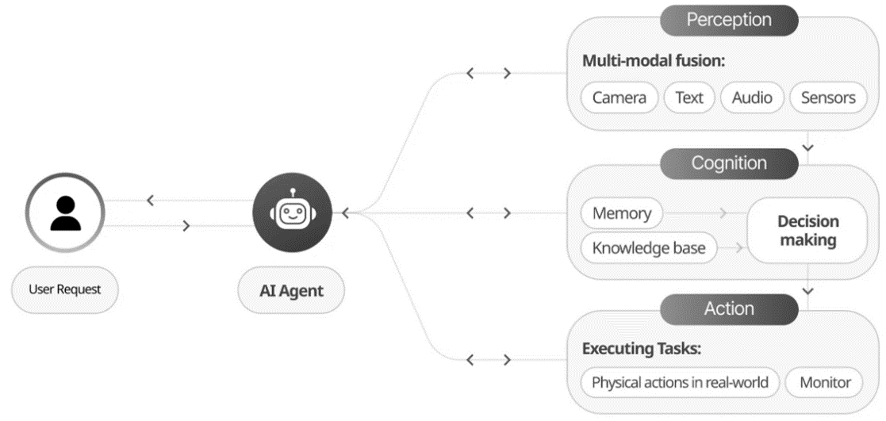
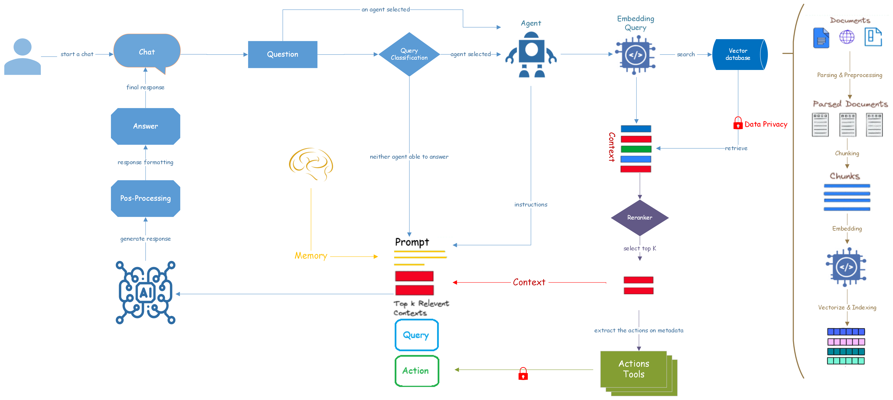

# AI Agent Architecture
### An architectural approach and design patterns for building AI Agents

In the rapidly evolving landscape of Artificial Intelligence, the development of intelligent Agents stands at the forefront of innovation. These sophisticated systems, capable of perceiving their environment and taking autonomous actions, are poised to revolutionize industries and transform our daily lives. This article delves into a proposal for an intelligent agent architecture that using the key techniques and methodologies.

Throughout this article, we will explore the typical AI agent process, highlighting best practices for each module within the architecture. From perception and reasoning to action selection and execution, we'll provide insights into optimizing each component for peak performance.

---

It might be helpful to define terms commonly used to refer to generative AI use cases in the market.

**AI agents** are designed to perform specific tasks, answer questions, and automate processes for users. These agents vary widely in complexity. They range from simple chatbots, to copilots, to advanced AI assistants in the form of digital or robotic systems that can run complex workflows autonomously.

**Copilots** are a type of AI agent. They work alongside users rather than operating independently. Unlike fully automated agents, copilots provide suggestions and recommendations to assist users in completing tasks.

**Agent architecture** defines the organizational structure and interaction of components within software agents or intelligent control systems, commonly referred to as cognitive architectures in intelligent agents. 

AI Agent are composed of several interconnected components that work together to enable intelligent behaviour. Each component plays a crucial role in the overall functioning of the AI system, and they must interact seamlessly to achieve desired outcomes. The image below show each **Core Components of AI Agent**.

 Figure 1: Core Components of AI Agents.

   

**LLM-based agents** are software systems that string together multiple processing steps, including calls to LLMs, in order to achieve a desired end result. Agents typically have some amount of conditional logic or decision-making capabilities, as well as a working memory they can access between steps.

For more information:
- https://arxiv.org/html/2404.11584v1
- https://arxiv.org/pdf/2309.07864

---

 Figure 2: An Architecture for AI Agent.

   

As shown in **Figure 2**, the proposed architecture for building a LLM-based Agent consists of several components, ach of which can utilize different techniques.

This approach is designed for a user who has multiple conversations and can interact with various AI agents. Depending on the user's question, the system selects the most suitable AI agent to provide an appropriate response.

### Chat & Conversational

Conversational agents facilitate interactive and dynamic conversations with users.

Conversation agents are optimized for conversation. They can engage in back-and-forth conversations, remember previous interactions, and make contextually informed decisions.

Conversational agents can be offer distinct features and functionalities that make them unique and tailored for interactive and dynamic conversations with users.

They’re different from other agents in a few ways:

1) Focus on Conversation: Conversational agents are designed to facilitate interactive and dynamic conversations with users. They are optimized for conversation and can engage in back-and-forth interactions, remember previous interactions, and make contextually informed decisions.
2) Multi-turn Interactions: Conversational agents excel in handling multi-turn conversations, where users can ask follow-up questions or provide additional information. They can maintain the context of the conversation and provide coherent and meaningful responses based on the entire conversation history.
3) Dynamic Decision-making: Conversational agents can make dynamic decisions based on the current conversation context and available information. They can retrieve and integrate real-time data from external systems through APIs, enabling them to provide up-to-date and accurate responses.

For more information:
- https://www.comet.com/site/blog/conversational-agents-in-langchain/
- https://js.langchain.com/v0.1/docs/modules/agents/agent_types/chat_conversation_agent/
- https://medium.com/@atulkumar_68871/incorporating-chat-history-in-conversational-agents-using-langchain-9045b85edb78

**Code example**: Come soon 

### Query Classification

This is the first layer of defense against inappropriate or out-of-scope queries. It analyzes the incoming user questions and determines whether they fall within the predefined scope of acceptable queries. This classifier is trained on a dataset of expected questions and the types of questions to avoid, effectively acting as a gatekeeper.

Query Classifier routes your queries to the Agent that are best suited to handling them. You can use it to classify keyword-based queries and questions to achieve better search results. 

The each new Query, the router will take that information, combine it with its existing knowledge of the possible next steps, and choose most able Agent to response.

- https://medium.com/ai-advances/advanced-rag-11-query-classification-and-refinement-2aec79f4140b
- https://docs.haystack.deepset.ai/v1.25/docs/query_classifier

